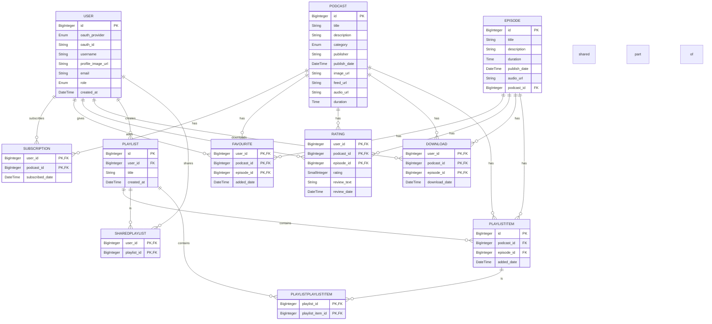

Sure, here is the Entity-Relationship Diagram (ERD) for the Podcast Management System based on the provided database models:

```mermaid
erDiagram
    USER {
        BigInteger id PK
        Enum oauth_provider
        String oauth_id
        String username
        String profile_image_url
        String email
        Enum role
        DateTime created_at
    }
    PODCAST {
        BigInteger id PK
        String title
        String description
        Enum category
        String publisher
        DateTime publish_date
        String image_url
        String feed_url
        String audio_url
        Time duration
    }
    EPISODE {
        BigInteger id PK
        String title
        String description
        Time duration
        DateTime publish_date
        String audio_url
        BigInteger podcast_id FK
    }
    SUBSCRIPTION {
        BigInteger user_id PK, FK
        BigInteger podcast_id PK, FK
        DateTime subscribed_date
    }
    FAVOURITE {
        BigInteger user_id PK, FK
        BigInteger podcast_id PK, FK
        BigInteger episode_id PK, FK
        DateTime added_date
    }
    RATING {
        BigInteger user_id PK, FK
        BigInteger podcast_id PK, FK
        BigInteger episode_id PK, FK
        SmallInteger rating
        String review_text
        DateTime review_date
    }
    DOWNLOAD {
        BigInteger user_id PK, FK
        BigInteger podcast_id PK, FK
        BigInteger episode_id PK, FK
        DateTime download_date
    }
    PLAYLIST {
        BigInteger id PK
        BigInteger user_id FK
        String title
        DateTime created_at
    }
    PLAYLISTITEM {
        BigInteger id PK
        BigInteger podcast_id FK
        BigInteger episode_id FK
        DateTime added_date
    }
    SHAREDPLAYLIST {
        BigInteger user_id PK, FK
        BigInteger playlist_id PK, FK
    }
    PLAYLISTPLAYLISTITEM {
        BigInteger playlist_id PK, FK
        BigInteger playlist_item_id PK, FK
    }

    USER ||--o{ SUBSCRIPTION : subscribes
    PODCAST ||--o{ SUBSCRIPTION : has
    USER ||--o{ FAVOURITE : adds
    PODCAST ||--o{ FAVOURITE : has
    EPISODE ||--o{ FAVOURITE : has
    USER ||--o{ RATING : gives
    PODCAST ||--o{ RATING : has
    EPISODE ||--o{ RATING : has
    USER ||--o{ DOWNLOAD : downloads
    PODCAST ||--o{ DOWNLOAD : has
    EPISODE ||--o{ DOWNLOAD : has
    USER ||--o{ PLAYLIST : creates
    PLAYLIST ||--o{ PLAYLISTITEM : contains
    PODCAST ||--o{ PLAYLISTITEM : has
    EPISODE ||--o{ PLAYLISTITEM : has
    USER ||--o{ SHAREDPLAYLIST : shares
    PLAYLIST ||--o{ SHAREDPLAYLIST : is shared
    PLAYLIST ||--o{ PLAYLISTPLAYLISTITEM : contains
    PLAYLISTITEM ||--o{ PLAYLISTPLAYLISTITEM : is part of
```